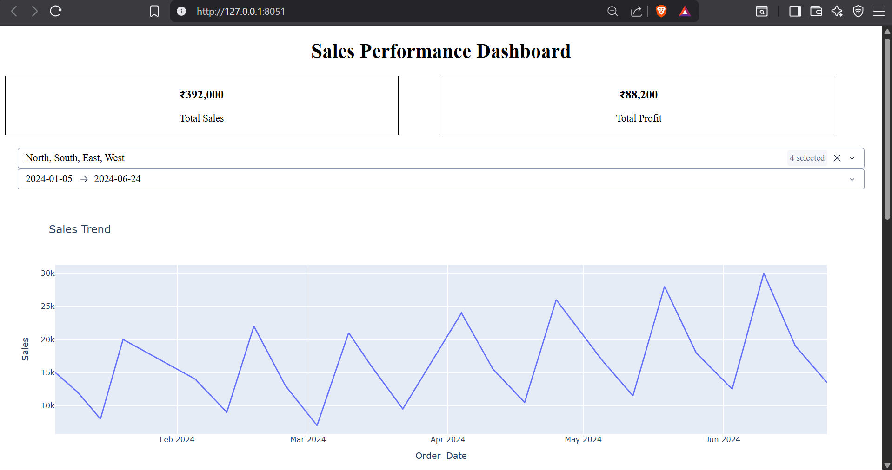
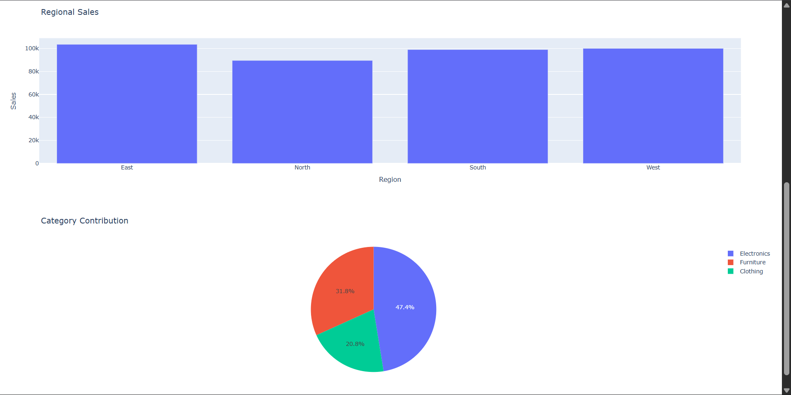

# 📊 Interactive Sales Performance Dashboard

An interactive, single-page business intelligence web application designed to monitor corporate sales health, track regional profitability, and evaluate product catalog velocity.

This project bypasses traditional static reporting by providing business stakeholders with dynamic controls to filter performance metrics across distinct regions and operational timeframes.

---

## 🔍 Live Interface Preview
Below is a visual breakdown of the operational layout dashboard designed for high-level business tracking:


 
---

## 🛠️ Tech Stack & Prerequisites

This application is engineered entirely using the **Python** data science ecosystem and the **Plotly Dash** framework. To execute this code locally, you must install the following core libraries:

```bash
pip install pandas plotly dash
